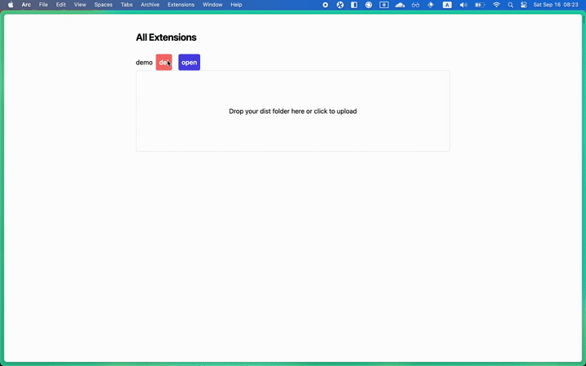

# Eidos Extension System

The Eidos Extension System is a solution for implementing extensions in web applications. Please note that this project is currently a proof-of-concept (POC) and should not be used in production.

This project is only a part of the whole system, it can install extensions locally, but it doesn't include the SDK and the communication between extension and web app.


## How it Works

TODO:

## What Can It Do

TL;DR: deploy a static web app within a web app.



This project is a part of [Eidos](https://github.com/mayneyao/eidos) (open source soon) and comes with an unexpected feature - the ability to deploy a static web app within a web app. Instead of using separate programs like `npx serve`, `python -m http.server`, or Docker to deploy your static web app locally, you can simply drop the output from the dist folder into this Progressive Web Application (PWA) and start it with a single click.


### Try it with the provided example

Clone the repository by running the following command in your terminal:
```bash
git clone https://github.com/mayneyao/eidos-extension-system.git
```

Open [the Demo](https://eidos-extension-system.vercel.app/) in your web browser.

Locate the sqlite3-fiddle directory within the cloned repository and drag it onto the web page.
This will automatically deploy the sqlite3-fiddle static web app within the Demo.

### Try it on your own

Please note that there are some limitations at the moment:
- every time we append a new extension, we need to bind a subdomain to the extension in cloudflare worker, if you want to deploy the worker by yourself, use the code in `src/lib/worker.js` and bind the subdomain to the worker. 

for testing, you can use `demo` as extension's name. don't need to deploy the worker.

for example, quick start with vite:

```
pnpm create vite
```

follow the instructions to create a vite project. then build it

```
pnpm build
```

we need a package.json file to deploy the extension, a simple way is to copy the package.json file into the dist folder.

```
cp package.json dist
```

Open [the Demo](https://eidos-extension-system.vercel.app/) in your web browser. then drop the dist folder onto the web page. you will see the extension is installed.